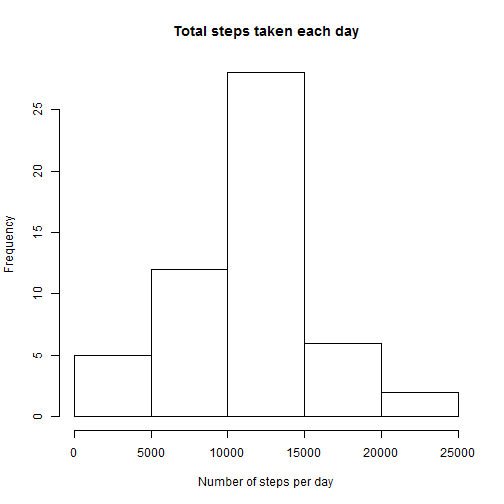
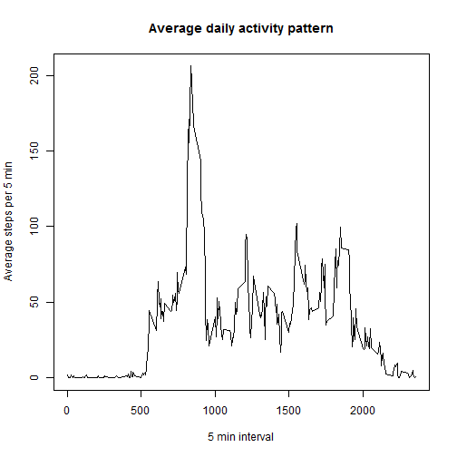
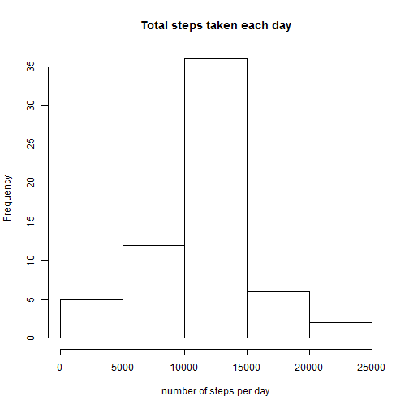
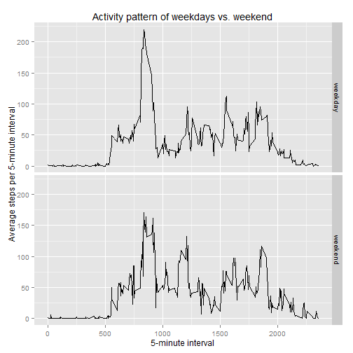

### Background Information
This is an analysis of data about personal movement using activity monitoring devices. This device collects data at 5 minute intervals through out the day. The data consists of two months of data from an anonymous individual collected during the months of October and November, 2012 and include the number of steps taken in 5 minute intervals each day.  

### Data
The variables included in this dataset are:  
- steps: Number of steps taking in a 5-minute interval (missing values are coded as NA)  
- date: The date on which the measurement was taken in YYYY-MM-DD format  
- interval: Identifier for the 5-minute interval in which measurement was taken  

The dataset is stored in a comma-separated-value (CSV) file and there are a total of 17,568 observations in this dataset. 

### Analysis
#### Step 1: set global option

```r
library(knitr)
opts_chunk$set(echo=TRUE, cache=TRUE)
```

#### Step 2: read the data

```r
setwd("D:/R/data/data/PA1")
activity <- read.csv("activity.csv", header = TRUE)
activity$date <- as.POSIXct(activity$date)
```

#### Step 3: about the number of steps taken per day

```r
## calculate total number of steps per day
steps <- aggregate(activity$steps~activity$date, FUN = sum)
```
A histogram of the total number of steps taken each day. Missing values ignored.

```r
hist(steps[,2], xlab = "Number of steps per day", main = "Total steps taken each day")
```

 

```r
## calculate mean and median
mymean <- mean(steps[,2])
mymedian <- median(steps[,2])
```
mean of total number of steps taken each day is 1.0766189 &times; 10<sup>4</sup>.  
median of total number of steps taken each day is 10765.

#### Step 4: What is the average daily activity pattern?

```r
## calculate the average numbers of steps in 5 min interval. 
## Averaged accross all days.
aveSteps <- aggregate(steps~interval, activity,mean)
plot(aveSteps, type = "l", xlab = "5 min interval", ylab = "Average steps per 5 min", main = "Average daily activity pattern")
```

 

```r
# find the 5-minute interval which contains the maximum number of steps.
a <- aveSteps[which.max(aveSteps[,2]),1]
```

The 835th interval contains the maximum number of steps.

#### Step 5: Imputing missing values

```r
# total number of missing value
miss <- sum(is.na(activity))
# the system to fill NAs with the 5-min interval mean
newAct <- activity
newAct$steps <- as.numeric(newAct$steps)
for (i in 1:nrow(activity)) {
        if (is.na(newAct$steps[i]) == TRUE) {
        newAct$steps[i] <- aveSteps[newAct$interval[i]==aveSteps$interval,2]
        }
}
# histogram of new data
newsteps <- aggregate(newAct$steps~newAct$date, FUN = sum)
hist(newsteps[,2], main = "Total steps taken each day", xlab = "number of steps per day")
```

 

```r
newmean <- mean(newsteps[,2])
newmedian <- median(newsteps[,2])
```
After filling missing values, the new mean is 1.0766189 &times; 10<sup>4</sup>, the new median is 1.0766189 &times; 10<sup>4</sup>.  
In this case, imputing missing data has very little impact on the total steps per day. Mean was exactly same. Median was 1 step higher than the median before filling missing values.  

#### Step 6: compare activity pattern between weekdays and weekends

```r
# add a column to indicate whether a given date is weekdays or weekends.
library(timeDate)
for (i in 1:nrow(newAct)) {
        if (isWeekend(newAct$date[i]) == TRUE) {
                newAct[i,"is_weekend"] <- "weekend"
        } else {
                newAct[i,"is_weekend"] <- "weekday"
        }
}
# Devide data to 2 groups: weekdays and weekends, and calculate average steps per interval for each group.

group <- split(newAct,newAct$is_weekend)
weekdayAve <- with(group[[1]], aggregate(steps~interval, FUN = mean))
weekendAve <- with(group[[2]], aggregate(steps~interval, FUN = mean))
for (i in 1:nrow(newAct)) {
        if (newAct$is_weekend[i] == "weekend") {
                newAct[i,"newStepAve"] <- weekendAve[newAct$interval[i]==weekendAve$interval,2]
        } else {
                newAct[i,"newStepAve"] <- weekdayAve[newAct$interval[i]==weekdayAve$interval,2]
        }
}
# plot average steps per 5-min interval for weekdays and weekends.
library(ggplot2)
qplot(interval, newStepAve, data = newAct, facets = is_weekend~., geom = "line", main = "Activity pattern of weekdays vs. weekend", xlab = "5-minute interval", ylab = "Average steps per 5-minute interval") 
```

 
